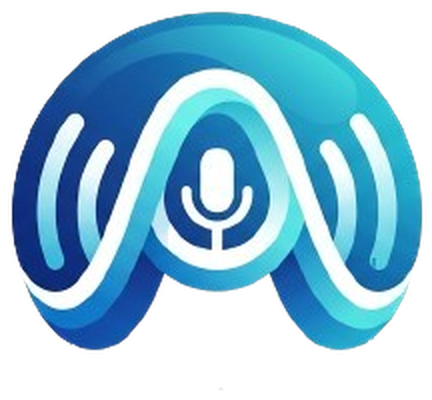

  

<h1 align="center">AssistVoice</h1>

  
  
  

Офлайн голосовой помощник для Huawei Watch 4 Pro. Распознаёт заранее настроенные голосовые команды прямо на часах, без интернета, и по каждой из них либо открывает приложение, либо звонит контакту — без необходимости открывать сам AssistVoice в момент срабатывания.

Обычное Android-приложение оптимизированное для работы на часах.

## Возможности

- **Полностью офлайн распознавание речи** — [Vosk](https://alphacephei.com/vosk/) с маленькой русской моделью, без обращения к интернету и без отправки голоса куда-либо.
- **Несколько независимых голосовых команд** ("слотов"). Каждая — это своя пара «слово-триггер → действие»: запуск приложения или звонок контакту.
- **Слушает только пока включён домашний экран часов** — не расходует батарею и микрофон в кармане или на запястье выключенных часов, а так же при работе с другими приложениями. В большинстве случаев для активации требуется циферблат с активной анимацией на борту, из-за особенностей работы микроконтроллера (MCU) и микропроцессора (CPU) часов.
- **Работает в фоне устойчиво** — реализовано как `AccessibilityService`, а не обычный фоновый сервис, чтобы не выгружаться системой при первой возможности.
- **Индикатор микрофона** на циферблате во время прослушивания — настраиваемый по размеру, положению и цвету.
- **Настраиваемая чувствительность** (порог голосовой активности) с живым просмотром уровня сигнала прямо на часах в приложении на отдельной вкладке.

## Как это работает

Команда всегда состоит из двух слов — фиксированного префикса действия и слова, которое задаёт сам пользователь: «открой ‹слово›» запускает приложение, «позвони ‹слово›» звонит контакту.

Распознаватель Vosk работает с ограниченной грамматикой в set-Grammar режиме (список допустимых слов и фраз), а не в полностью открытом режиме — это на порядок дешевле по нагрузке на процессор часов, что критично для отзывчивости на этом железе.

Перед распознаванием стоит VAD (Voice Activity Detection, «определение голосовой активности») — простой энергетический гейт, который держит декодер выключенным, пока рядом с часами тихо, и включает его только когда уровень сигнала с микрофона превышает заданный порог. Порог абсолютный, а не подстраивающийся под фоновый шум: команда произносится с поднесёнными ко рту часами, а это всегда намного громче любого фона, поэтому адаптивный порог тут не нужен и только сглаживал бы эту разницу. Ещё два параметра управляют границами гейта: «хвост» — сколько миллисекунд тишины после речи считается концом фразы, и «преролл» — сколько звука до срабатывания порога всё равно попадает в распознавание, чтобы не срезался первый слог. Все три подбираются на странице «Порог микрофона» по живому уровню сигнала (см. раздел «Установка и настройка на часах»).

Фоновая часть работает как `AccessibilityService` — вместе с отдельным вспомогательным foreground-сервисом, который держит процесс в состоянии, необходимом Android для реальной работы микрофона в фоне. AccessibilityService не читает содержимое экрана и не имеет отношения к специальным возможностям в обычном смысле — используется исключительно как процесс, который прошивка не выгружает так же агрессивно, как обычный фоновый сервис.

## Приватность

- Распознавание речи идёт целиком на часах — записанный звук никогда не покидает устройство и не отправляется ни на какой сервер.
- Контакты читаются только для того, чтобы показать список для выбора цели звонка в слоте, и никуда не передаются.
- Единственное сетевое обращение во всём приложении — кнопка «Проверить обновления» (см. ниже), и оно происходит только по нажатию, никакого фонового опроса нет.
- Никакой аналитики, телеметрии или сбора статистики использования в приложении нет.

## Требования

- Huawei Watch 4 Pro (или устройство на сопоставимой прошивке)
- `minSdk` 26, `compileSdk` 34

## Сборка

Проект не включает саму языковую модель распознавания — она весит около 50 МБ и не должна храниться как исходный код, поэтому её нужно скачать отдельно перед первой сборкой если появится желание сделать это самостоятельно.

1. Клонируйте репозиторий и откройте папку `AssistVoice`.
2. Скачайте маленькую русскую модель Vosk: [vosk-model-small-ru-0.22.zip](https://alphacephei.com/vosk/models/vosk-model-small-ru-0.22.zip) (полный список моделей — [alphacephei.com/vosk/models](https://alphacephei.com/vosk/models)).
3. Распакуйте архив и скопируйте его содержимое (папки `am`, `conf`, `graph`, `ivector` и т.д. — без промежуточной папки) в `app/src/main/assets/model-ru/`.
4. Создайте пустой файл `app/src/main/assets/model-ru/uuid` (без расширения, содержимое - "1").
5. Дождитесь Gradle Sync и соберите APK (Build → Build Bundle(s) / APK(s) → Build APK(s)).

## Установка и настройка на часах

1. Установите APK с помощью ADB подключения и откройте приложение — оно запросит:
   - **Микрофон** — чтобы слушать команды.
   - **Контакты** — чтобы можно было выбрать, кому звонить по команде.
   - **Отображение поверх других приложений** — для индикатора микрофона на циферблате.

2. Включите службу вручную: **Специальные возможности → Службы → AssistVoice**.
3. Переведите приложение в ручной режим автозапуска: **Приложения → Диспетчер запуска → AssistVoice**.
4. Разрешите целевым приложениям запускаться сторонними приложениями через Диспетчер запуска, иногда это требуется, иногда нет.
5. На странице «Команды» настройте свои слоты — выбор приложения или контакта идёт из реального списка на часах, слово-триггер выбираете сами.
6. На странице «Порог микрофона» (следующая после «Команды») откалибруйте чувствительность: поднесите часы ко рту, скажите команду и запомните пик уровня, затем помолчите и посмотрите фоновый уровень — порог выставьте между ними. Там же настраиваются «Хвост» (сколько тишины считается концом фразы) и «Преролл» (сколько звука до срабатывания порога попадает в распознавание, иначе срезается начало слова), а также «Держать экран после команды» — сколько секунд после срабатывания держать экран включённым, чтобы он не погас, пока запускается приложение (0 — выключить).
7. На следующей странице, «Иконка микрофона», включите или отключите индикатор, подберите его размер и положение (X/Y от центра экрана) и цвет отдельно для состояния запуска и записи — по живому предпросмотру на экране.
8. Последняя страница, «Поддержать», — три QR-кода: отблагодарить разработчика и подписаться на его каналы в Telegram и Max. Отсканируйте телефоном.

## Автообновление

На стартовом экране («Инфо») есть кнопка «Проверить обновления» — она спрашивает у GitHub, какой релиз этого репозитория последний, и если он новее установленной версии, предлагает скачать и поставить APK прямо на часах. Никакого фонового опроса нет, только по нажатию.

## Известные ограничения

- Точность распознавания не идеальна — возможны ложные срабатывания.
- На некоторых статичных (неанимированных) циферблатах CPU часов не выходит из сна при первой активации экрана, что делает невозможным вызов фонового процесса с прослушиванием микрофона.
- После срабатывания слота распознавание ненадолго приостанавливается (около 2.5 секунд, до нескольких секунд после звонка).

## Стек

Kotlin, AppCompat (без Jetpack Compose и Wear-специфичных библиотек), [vosk-android](https://github.com/alphacep/vosk-api) для офлайн-распознавания речи, JNA.

## Лицензия

MIT.
